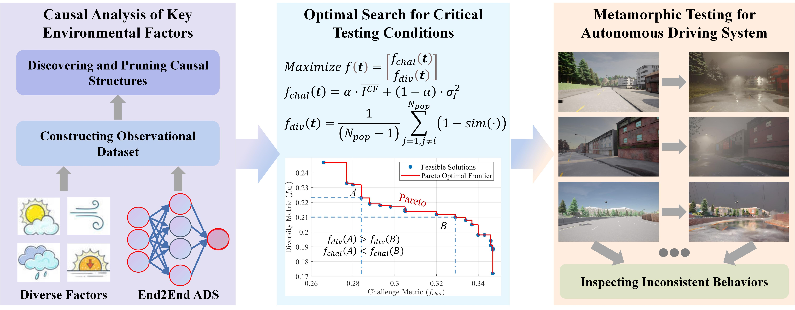
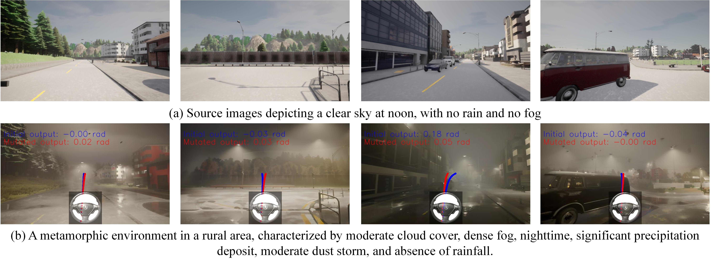

# **Metamorphic Testing for Vision-Based Autonomous Driving With Road Traffic Risk Exposure Extrapolation**

This repository contains the implementation of the **"Metamorphic Testing for Vision-Based Autonomous Driving With Road Traffic Risk Exposure Extrapolation**. Our framework integrates **causal inference** and **diffusion models"** to improve the reliability testing of ADS, enabling the detection of faults under diverse and critical test conditions.

## Table of Contents
1. [Overview](#overview)
2. [Folder Structure](#folder-structure)
3. [Data Preparation](#data-preparation)
4. [Usage Example](#usage-example)
5. [Citing This Work](#citing-this-work)
6. [References and Useful Links](#references-and-useful-links)

---

## Overview

This repository provides tools and methods for performing metamorphic testing on vision-based ADS. The framework includes:
- **Causal inference** to identify critical driving conditions.
- **Finetuned diffusion model** to transform source images to high-risk test cases.
- **Baselines for comparison**, such as Random/DeepTest/DeepRoad/TACTIC/CycleGAN metamorphic testing approaches.


The repository is organized into multiple folders, each serving a specific purpose in the testing pipeline. Below is a detailed description of the folder structure and key files.

---

## Folder Structure

- `Autopilot/`: 
  - Contains 5 implementations of the tested autonomous driving algorithms.
  - Includes the source images that are used as input for metamorphic.
  - Statistical analysis of the performance of various ADS models on a given dataset.

- `Baselines/`: 
  - Includes test images generated by the Metamorphic Testing baselines. 
  - Statistical evaluations of the quality of test images produced by the baseline method and the inconsistent behaviors observed.
  - `TACTIC/`: 
    - Implements representative metamorphic testing baselines for comparison.
    - Subfolders include:
      - `do_testing/`: Main implementations for TACTIC testing.
      - `logger/`: Logs and records of TACTIC search results.
      - `munit/`: Contains random MUNIT-based and DeepRoad-based Metamorphic Testing methods and weights.
      - `test_outputs/`: Stores mutation results generated by baseline methods.
      - `train_outputs/`: Tracks neuron coverage during the training of the tested algorithms.

- `CausalAnalysis/`: 
  - Houses structural causal models and counterfactual models.
  - Implements a multi-objective search framework to identify critical test conditions.

- `DataGenerator/`: 
  - Collecting data from CARLA to train ADS models.
  - Loading `carlaenv.xlsx` to generate randomized environments for collecting observational datasets.

- `Metamorphic/`: 
  - Applies the identified test conditions to transform source images into high-risk driving scenes using a fine-tuned diffusion model.

- `requirements.txt`: 
  - Lists all Python dependencies required to run the project.

---

## Data Preparation

Some datasets required for this project are too large to be included in the repository. Follow the steps below to download and prepare the data:

1. **Download the datasets**:
   - **driving_dataset**: Download from: https://pan.baidu.com/s/1iwOmatIAvyRfmjkAZOaUXg?pwd=6z6b Extraction code: 6z6b.
   - **Transformed Test Cases of Baselines**: Download from: https://pan.baidu.com/s/1aflcakk0ges3egj9j-tj3Q?pwd=a394 Extraction code: a394.
   - **Finetuned Lora weights**: Download from: https://pan.baidu.com/s/1GAXGTY5iiyPoSXEPY_PqkA?pwd=8dvb Extraction code: 8dvb.
   - **Transformed Test Cases**: Download from: https://pan.baidu.com/s/1nPKse2P7FnPj7wJlYc7wDA?pwd=n9mf Extraction code: n9mf.
   - **Training weights for ADS (cg23)**: Download from: https://pan.baidu.com/s/1nWui6UmhyTOC99yG72i4tA?pwd=ejtg Extraction code: ejtg.
   - **Training weights for ADS (cnn_gru)**: Download from: https://pan.baidu.com/s/1KpOx7-YcsXEZxf-_yyNV1w?pwd=cr84 Extraction code: cr84.
   - **Training weights for ADS (PilotNet)**: Download from: https://pan.baidu.com/s/1TqQSBf0dvOJUvBAsgtyaPw?pwd=ftam Extraction code: ftam.
   - **Training weights for ADS (stacked_cnn)**: Download from: https://pan.baidu.com/s/1s45G-KtAxwCUf-Xhf_5zxw?pwd=mwfq Extraction code: mwfq.
   - **Training weights for ADS (two_stream_cnn)**: Download from: https://pan.baidu.com/s/1ppHS2zfKaJDVC8j_S-wrdw?pwd=7aq5 Extraction code: 7aq5.

2. **Organize the data**:
   - Place the original "driving_dataset" into the `Autopilot/` folder.
   - Place the "Transformed Test Cases of Baselines" into the `Baselines/` folder. 
   - Place the "Transformed Test Cases" into the `Metamorphic/` folder.
   - Place the "Training weights for ADS" into the corresponding ADS subfolder, such as `Autopilot/cg23` .

3. **Extract and organize**:
   - Ensure that all downloaded files are extracted and organized as follows:
     ```
     Autopilot/
       └── driving_dataset/
       └── cg23/save
     Baselines/
       └── CycleGAN/
       └── DeepTest/
       └── Random/
       └── TACTIC/
     Metamorphic/
       └── mutation_0/
       └── mutation_1/
       ...

     ```
---

## Usage Example

Below is an example of how to perform metamorphic testing using the provided framework:

1. **Install dependencies**:
   ```bash
   pip install -r requirements.txt

2. **Generate high-risk test images**:
Navigate to the Metamorphic/ folder and execute:
   ```bash
   python run_mutation.py



All generated test cases have been saved in "Transformed Test Cases" dataset.

NOTE: Refer to the following link (https://github.com/AUTOMATIC1111/stable-diffusion-webui) to install Stable Diffusion and use our LoRA model.

## Citing This Work

If you find this repository or our work helpful, please consider citing our paper:

```bibtex

@article{
  author={Jiang, Zhengmin and Zhang, Shunran and Liu, Jia and Li, Huiyun and Pan, Yi and Wang, Jianping},
  journal={IEEE Transactions on Intelligent Transportation Systems}, 
  title={Metamorphic Testing for Vision-Based Autonomous Driving With Road Traffic Risk Exposure Extrapolation}, 
  year={2026},
  volume={},
  number={},
  pages={1-14},
  keywords={Testing;Mathematical models;Environmental factors;Diffusion models;Neurons;Safety;Cognition;Autonomous vehicles;Training;Road traffic;Road transportation;autonomous driving;methods for safety;metamorphic testing;causal inference},
  doi={10.1109/TITS.2025.3649971}}

```

## References and Useful Links

Here are some additional resources and datasets that may be useful:

- **Autonomous Driving Datasets**:
  - [udacity dataset](https://github.com/udacity/self-driving-car)
  - [California dataset](https://github.com/SullyChen/driving-datasets?tab=readme-ov-file)
  - [comma2k19 dataset](https://github.com/commaai/comma2k19)

